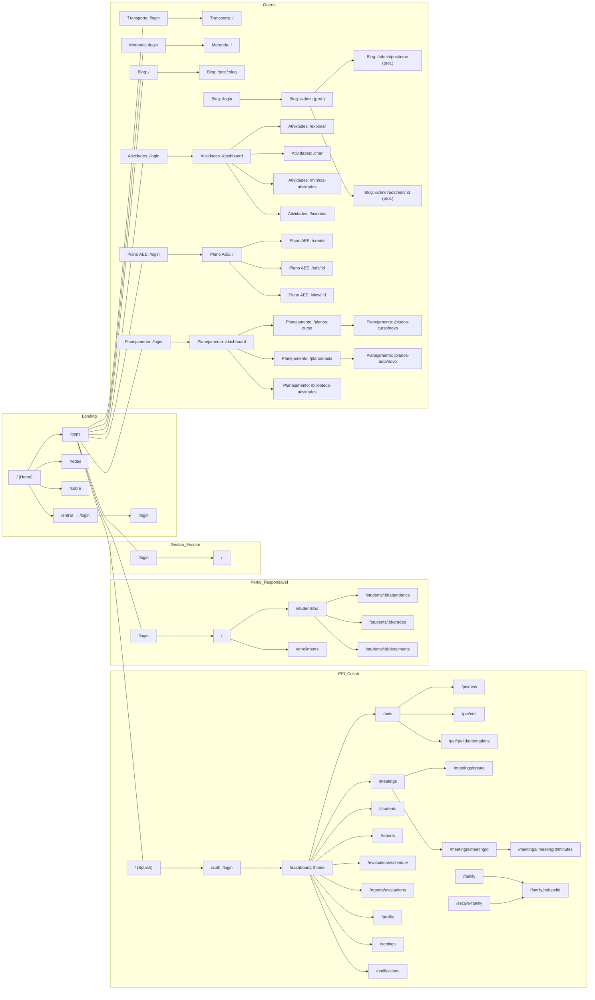

# Mapa de Navegação e Jornadas do Usuário

Este documento consolida as rotas principais por aplicação e apresenta diagramas simplificados das jornadas de navegação.

## Visão Geral de Apps e Rotas

- Landing (`apps/landing`)
  - `/` Home
  - `/login` Login
  - `/apps` Seletor de Apps
  - `/redes` Selecionar Rede
  - `/sobre` Sobre
  - `/entrar` Redireciona para `/login`

- PEI Collab (principal) (`apps/pei-collab/src/App.tsx`)
  - Autenticação e início
    - `/` Splash
    - `/auth` Login
    - `/login` Login
    - `/auth/reset-password` Recuperação de senha
    - `*` NotFound
  - Dashboard e navegação
    - `/home` Dashboard
    - `/dashboard` Dashboard
    - `/profile` Perfil
    - `/settings` Configurações
    - `/notifications` Notificações
  - PEI e reuniões
    - `/peis` Lista de PEIs
    - `/pei/new` Criar PEI
    - `/pei/edit` Editar PEI
    - `/pei/:peiId/orientations` Orientações do PEI
    - `/pei/:peiId/meetings` Reuniões do PEI
    - `/meetings` Painel de reuniões
    - `/meetings/create` Criar reunião
    - `/meetings/:meetingId` Detalhes da reunião
    - `/meetings/:meetingId/minutes` Atas da reunião
  - Estudantes e relatórios
    - `/students` Lista de estudantes
    - `/reports` Relatórios gerais
    - `/evaluations/schedule` Agendar avaliações
    - `/reports/evaluations` Relatório de avaliações
  - Acesso da família
    - `/family` Acesso família (convite/link padrão)
    - `/secure-family` Acesso família seguro (token)
    - `/family/pei/:peiId` Visualização do PEI pela família
  - Auxiliares e debug
    - `/teste`, `/debuguser`
    - `/debug/database`, `/debug/usability`, `/debug/notifications`

- Gestão Escolar (`apps/gestao-escolar/src/App.tsx`)
  - `/login` Login
  - `/` Dashboard (protegido)
  - Observação: rotas internas (ex.: `/students`, `/import`, `/export`) são protegidas e acessadas via menus do dashboard.

- Portal do Responsável (`apps/portal-responsavel/src/App.tsx`)
  - `/login` Login
  - `/` Dashboard (protegido)
  - `/students/:id` Detalhe do estudante
  - `/students/:id/attendance` Frequência
  - `/students/:id/grades` Notas
  - `/students/:id/documents` Documentos
  - `/enrollments` Matrículas

- Transporte Escolar (`apps/transporte-escolar/src/App.tsx`)
  - `/login` Login
  - `/` Dashboard (protegido)

- Merenda Escolar (`apps/merenda-escolar/src/App.tsx`)
  - `/login` Login
  - `/` Dashboard (protegido)

- Blog (`apps/blog/src/App.tsx`)
  - `/` Home
  - `/post/:slug` Visualização de post
  - `/login` Login
  - `/admin` Dashboard Admin (protegido)
  - `/admin/post/new` Criar post (protegido)
  - `/admin/post/edit/:id` Editar post (protegido)

- Atividades (`apps/atividades/src/App.tsx`)
  - `/login` Login
  - `/` Redireciona para `/dashboard`
  - `/dashboard` Dashboard (protegido)
  - `/explorar` Explorar atividades (protegido)
  - `/criar` Criar atividade (protegido)
  - `/minhas-atividades` Minhas atividades (protegido)
  - `/favoritas` Favoritas (protegido)

- Plano AEE (`apps/plano-aee/src/App.tsx`)
  - `/login` Login
  - `/` Dashboard (protegido)
  - `/create` Criar plano (protegido)
  - `/edit/:id` Editar plano (protegido)
  - `/view/:id` Visualizar plano (protegido)

- Planejamento (`apps/planejamento/src/App.tsx`)
  - `/login` Login
  - `/` Redireciona para `/dashboard`
  - `/dashboard` Dashboard (protegido)
  - `/planos-curso` Planos de curso (protegido)
  - `/planos-curso/novo` Criar plano de curso (protegido)
  - `/planos-aula` Planos de aula (protegido)
  - `/planos-aula/novo` Criar plano de aula (protegido)
  - `/biblioteca-atividades` Biblioteca de atividades (protegido)

---

## Diagrama — Ecossistema de Apps

---

## Jornadas do Usuário

- Onboarding (usuário geral)
  - Entra no Landing (`/`) → clica em “Entrar” (`/entrar → /login`) → autentica.
  - Acessa o Seletor de Apps (`/apps`) ou é levado ao app padrão do perfil.
  - Chega ao Dashboard do app escolhido e usa atalhos principais.

- Professor/Coordenador (PEI Collab)
  - Login (`/auth` ou `/login`) → Dashboard (`/dashboard`).
  - Cria/edita PEI (`/pei/new` ou `/pei/edit`) → Adiciona orientações (`/pei/:peiId/orientations`).
  - Agenda reunião (`/meetings/create`) → Registra atas (`/meetings/:meetingId/minutes`).
  - Consulta estudantes (`/students`) e relatórios (`/reports`, `/reports/evaluations`) → Ajusta notificações e perfil (`/notifications`, `/profile`).

- Família/Responsável (PEI Collab + Portal do Responsável)
  - Recebe link de acesso seguro (`/secure-family` ou `/family`) → Visualiza PEI (`/family/pei/:peiId`) e orientações.
  - No Portal: Dashboard (`/`) → Detalhes do estudante → Frequência, Notas, Documentos, Matrículas.

- Administrador/Secretaria (Gestão Escolar)
  - Login (`/login`) → Dashboard protegido (`/`).
  - Executa tarefas de gestão via menus (alunos, profissionais, turmas, importação/exportação).

- Planejamento Pedagógico
  - Login (`/login`) → Dashboard (`/dashboard`).
  - Planos de curso (`/planos-curso/novo`) e de aula (`/planos-aula/novo`).
  - Biblioteca de atividades (`/biblioteca-atividades`).
  - Em Atividades: Explora (`/explorar`), cria (`/criar`), organiza catálogo (`/minhas-atividades`, `/favoritas`).

- Conteúdo/Comunicação (Blog)
  - Visitante: navega por posts (`/post/:slug`).
  - Editor/Admin: Login (`/login`) → Admin (`/admin`) → cria/edita posts.

---

## Observações

- Rotas protegidas usam `ProtectedRoute` (autenticação e, em alguns apps, verificação de permissões/tenant).
- Há duplicidades intencionais de caminhos para facilitar navegação (`/home` e `/dashboard` no PEI Collab).
- Páginas de debug auxiliam QA e suporte (`/debug/*`).
- Fallback para rotas desconhecidas: `*` → `NotFound`.

## Referências (arquivos de rotas)

- `apps/pei-collab/src/App.tsx`
- `src/App.tsx` (base — algumas rotas espelham o app principal)
- `apps/gestao-escolar/src/App.tsx`
- `apps/landing/src/App.tsx`
- `apps/portal-responsavel/src/App.tsx`
- `apps/transporte-escolar/src/App.tsx`
- `apps/merenda-escolar/src/App.tsx`
- `apps/blog/src/App.tsx`
- `apps/atividades/src/App.tsx`
- `apps/plano-aee/src/App.tsx`
- `apps/planejamento/src/App.tsx`